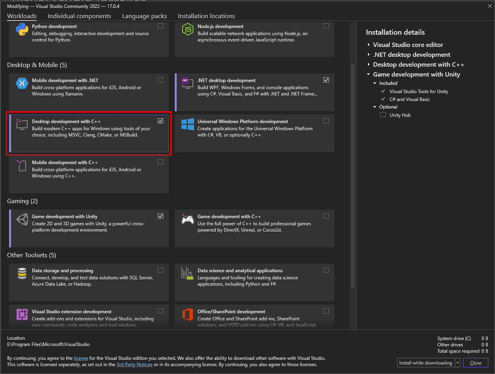

<h1 align="center"> How to use multiple code files(Custom Headers and Source) in C++ for beginners.</h1>

**Introduction**

In the last article of mine, we covered how we can use multiple files in C++ for Functions if you haven’t checked it out yet, you can do so at [How To Use Multiple Code Files In C++](https://www.c-sharpcorner.com/article/how-to-use-multiple-code-files-in-cpp/). But now the question arises why do we even need to use multiple files in C++? Can’t we just write everything in one file?

**Why even use Multiple code files in C++?**

The answer is yes, yes you can write everything in one file if you are working on a smaller console applications. But if you tried to do this in large projects, then it will make your code an absolute mess.

So, once our program gets larger. We should split our programs in multiple files for easy maintainability and reusability of our code.

For this, You should use an Integrated Development Environment. This will greatly ease the process. [Visual studio code](https://code.visualstudio.com/)  can also be used, but it will make the task unnecessarily hard, [Visual studio Community](https://visualstudio.microsoft.com/vs/community/) (it is free version of visual studio which is a free version of Visual studio Professional and Visual studio Enterprise) In this article we will be using [Visual studio Community](https://visualstudio.microsoft.com/vs/community/).

**Requirements**

- Basic Knowledge of C++ Programming
- Basic Knowledge of Object Oriented Programming(OOPS)
- Visual Studio Community
  - Desktop development with C++ workload



*Workload window of Visual studio community*

**NOTE: I WILL NOT BE COVERING HOW TO INSTALL OR STEP UP VISUAL STUDIO COMMUNITY IN THIS ARTICLE.** 

*For Installing and setting up Visual Studio Community for C++ visit the MS website for [Visual Studio Community for C++*](https://visualstudio.microsoft.com/vs/features/cplusplus/)*

*Here you can get to know about the setup process of Visual Studio Community for C++*


**Step-by-step instructions**

Step 1 – Launch Visual Studio Community by Double clicking on its icon or ***right click/open.***


*Open Visual Studio community*

Step 2 – Once Visual Studio Community open up, click on ***create a new Project.***


Create a new Project

Step 3 – Search for ***C++ Console app*** and ***Click*** on it. Or you can choose it from recent templates if you have used console application before.


*Choose appropriate template(C++ Console application)*

Step 4 – Configure your Project as required. Put your ***Project name*** and a ***location(*Directory*)*** in the fields. And click ***create***.

Now Visual Studio Community will create a solution for you.

Solutions: A solution is simply a container Visual Studio use to organize one or more related projects.


*Configure newly created project*

Step 5 – When Visual Studio Community Editor opens up. Look for ***Solution Explorer***, its either in RHS or LHS. In ***solution explorer*** click of ***Source files*** and you will see an initial file that the Visual Studio Community provides. And it will open the hello world program in The editor


*An Initial hello world program provided by Visual Studio community*


Solution explorer tab

Step 6 – Create a ***new item***. By right clicking Project in ***solution explorer*** then click ***Add*** and in next option menu click on ***new item***.


Create a new Item 


Step 7 – Select ***C++ File (.cpp)*** File. Give the new file a name(we will use “Square”), and it will be added to your project.


Choose a CPP Source file


Make Square function in Square.cpp 

In newly created c++ file, For the sake of simplicity, We will write a function that take one integer number as parameter and then returns the square of given integer number. 

Now edit the Main File(“MultiClass.cpp.cpp”) so that the initial file Visual Studio Community Provided use the function Square we have just created also add a forward declaration for square function. So that Visual studio community do not throw an error. about “Square is undefined”

Now we have these files in our solution

**MultiClass.cpp**
```cpp
#include <iostream>

int square(int num); //This will tell the compiler that this function is written somewhere in solution.

int main()

{

    int num = 0;

    std::cout << "The a number to find it's square: ";

    std::cin >> num;

    std::cout << "The square of the number" << num << " is " << square(num);

}
```
**Square.cpp**
```cpp
int square(int num)

{

    return (num \* num);

}
```
According to this method we will have to include as many forward declarations as many functions we want to use, that would be quite tedious. To fix this we will have to use **custom header** files that we are going to create next.

Writing a header file is quite easy, header files have these parts in it:

1. A header guard
1. The actual content of the header file, which will be the forward declarations(Prototype) for all of the identifiers(Functions in this case.) we want other files to be able to see.

Adding a Header File works same as how we added another CPP source file(Squre.cpp) 

**NOTE: Use a .h suffix when naming your header files.**

Step 8 – Create a ***new item***. By right clicking Project in ***solution explorer*** then click ***Add*** and in next option menu click on ***new item***.


Create a new item

Step 7 – This time select ***Header File (.h)*** File.

Header files are commonly used with CPP (Source) code files, with the header file providing forward declarations(Prototype) for the corresponding CPP code file. Since our header file will contain a forward declaration for functions defined in *Square.cpp*, we’ll Name our new header file *Square.h*. and Click *Create* and it will be added to your project.


Choose Header file

**NOTE:** If a header file is paired with a code file (e.g. Square.h with Square.cpp), they should both have the same base name (Square).

Also, Check in Solution explorer if it is added to your solution


Check if header is included in our solution

For now we will just put a Forward declaration in the header file for Square.cpp

We must use a header guard in the header files but, we are skipping it for now and will get back to it later on, in this article.

to use this header file “Square.h” in MultiClass.cpp, we have to #include it (using quotes, instead of angle brackets). After including Square.h we need not forward declare the Square in Main File(Multiclass.cpp) you must remove forward declaration from main file

**Forward Declaration in Square.h**
```cpp
int square(int num); //This will tell the compiler that this function is written somewhere in solution.
```
**Inclusion of Square.h in Main file(MultiClass.cpp)**
```cpp
#include <iostream>

#include "Square.h"

int main()

{

    int num = 0;

    std::cout << "The a number to find it's square: ";

    std::cin >> num;

    std::cout << "The square of the number" << num << " is " << square(num);

}
```


Include Header in main file

*If you Compile our Program now you will see that our program works as expected*

When the pre-processor processes the #include "Square.h" line, it copies the all the contents of Square.h into the Main File(MultiClass.cpp) file at that point. Because our *Square.h* contains a forward declaration for function Square, that forward declaration will be copied into MultiClass.cpp. which will result in program that is essentially same as the one where we manually added the forward declaration at the top of MultiClass.cpp.

so, our program will compile and links correctly.


**In Source files include their respected paired header files**

In C++, code files should #include their paired header file (if one exists). In the example above, Square*.cpp* includes Square*.h*.

This allows the compiler to catch errors like different return type at compile time instead of link time


Include paired Header file in Source file 

**NOTE:** Use double quotes to include header files that are written by you and are expected to be found in the current project directory. 

Use angled brackets to include headers that come with your compiler, OS, or third-party libraries you’ve installed elsewhere on your Computer system.

**Header Guards**

When we first introduced header files we listed two files that it should contain that are 

- A header guard
- The function declaration and macro definitions of the header file.

We learned about header files, but what about header guards. We will be cover them now.

We already know that a variable or function identifier can only have one definition. Thus, a program with multiple definitions of a variable identifier will cause a compilation error. Suppose these programs

Ex.1
```cpp
int main()

{

    int x; // definition for variable 

    int x; // compile error: you can’t have duplicate definitions

    return 0;

}
```
Ex.2
```cpp
#include <iostream>

int foo() // definition for function foo

{

    return 5;

}

int foo() // compile error: : you can’t have duplicate definitions 

{

    return 5;

}

int main()

{

    std::cout << foo();

    return 0;

}
```
These programs are easy to fix (just remove the duplicate definition), but with header files, You might end up in a situation where a definition in a header file gets included more than once. This can happen when a header file #includes another header file (which is very common).

To avoid Multiple Definitions of headers we can use Header Guards

**#pragma once**

Most Modern compilers including Visual Studio Community support a simple, form of header guards using the “*#pragma”* directive it is provided By default in Every Header File that we create in Visual Studio Community:

**Sqaure.h**
```
#pragma once
```
int square(int num); //This will tell the compiler that this function is written somewhere in solution.


Using #pragma once

**pragma once** is a non-standard but widely supported pre-processor directive designed to cause the current source file to be included only once in a single compilation. #pragma once serves the purpose of header guards, and has the added benefit of being shorter and less error-prone.

However, **#pragma** once is not an official part of the C++ language, but is used very commonly, and not all compilers support it (although most modern compilers do support #pragma once). If your compiler does not support **#pragma once** then, You can use traditional Header guards Also Known As include Guards.

**Disadvantage of #pragma once** is (other than being non-CPP standard) is that if you have the same file in multiple directories then the compiler will think these are different files as #pragma do not open the file to read its content this can also be seen as an advantage as it will reduce build time.

**#include Guards**

an **#include guard**, or a Header guard or file guard, is a construct used to avoid the problem of *double inclusion* by using include directive.

Header guards are little pieces of code that protect the contents of a header file from being included more than once if Header Files are included in our program more than once.

Header guards can be used through the use of pre-processor directives. The C/C++ pre-processor directives You are already familiar with some (#include, #define). The pre-processor performs some simple replacements on a file before handing it off for compilation to the compiler to the compiler.

Some pre-processor directives are conditional. The **#ifdef HEADER\_H** directive is true when **HEADER\_H** has been defined in the code before. If the **#ifdef HEADER\_H** directive is true, then the statements that come between the **#ifdef** and an **#endif** directive later on will be used in the program. If the **#ifdef HEADER\_H** directive is false, then the statements from that point on will be ignored like comments.

Another useful pre-processor directive is **#ifndef HEADER\_H**. This directive is true if the **HEADER\_H** has *not* been defined. If **#ifndef HEADER\_H** is true, then the statements between the **#ifndef** and an **#endif** will be included in the program.

Header guards are implemented by using three pre-processor directives in a header file. **#ifndef HEADER\_H** or **#ifdef HEADER\_H** and **#define HEADER\_H** is placed at the beginning of the file, before any code. The last **#endif** is placed at the end of the file.

```cpp
#ifndef HEADER\_H 

//and is followed immediately by the line

#define HEADER\_H 

//The line

#endif /\* MY\_SYMBOL\_H \*/

//is placed at the end of the file.
```

**Key Points**

The “**HEADER\_H”** used is not important, but it must be unique and recognizable by the programmer. It is traditional to use all caps letters for the **HEADER\_H**. Only letters, numbers and the underscore character can be used in the **HEADER\_H**. No other punctuation is allowed. 

A **HEADER\_H** is to use the name of the header file, converting the .h suffix to a \_H. The purpose of this is to serve as a marker. If the **HEADER\_H** is defined, then this section of code has been defined before and should not be included again. If the symbol has not been defined, then the code it is associated with has not been included. and will be included.


Using #ifndef, #define and #endif

Note: You can comment out large sections of code if you put a **#if 0** at the beginning of the code to be commented and a **#endif** at the end.

**NOTE:** You should stick to traditional header guards. They aren’t much more work and they’re guaranteed to be supported on all Standard compliant compilers.

**Summary**

In this article, we have learned that instead of writing all the functions in same C++ file in which we have main function, we can have the functions in separate files(Source files), and instead of writing forward declaration of every function in main.cpp file we can use custom headers(Header files) and we also learned how we can avoid double definitions by inclusion of headers with the help of #pragma once and traditional Header Guards this helps in avoiding definition conflicts, and improve the reusability of code and maintaining the code much easier.

I hope this article helped you, if you liked it, please Star this repo and share it with your friends.


